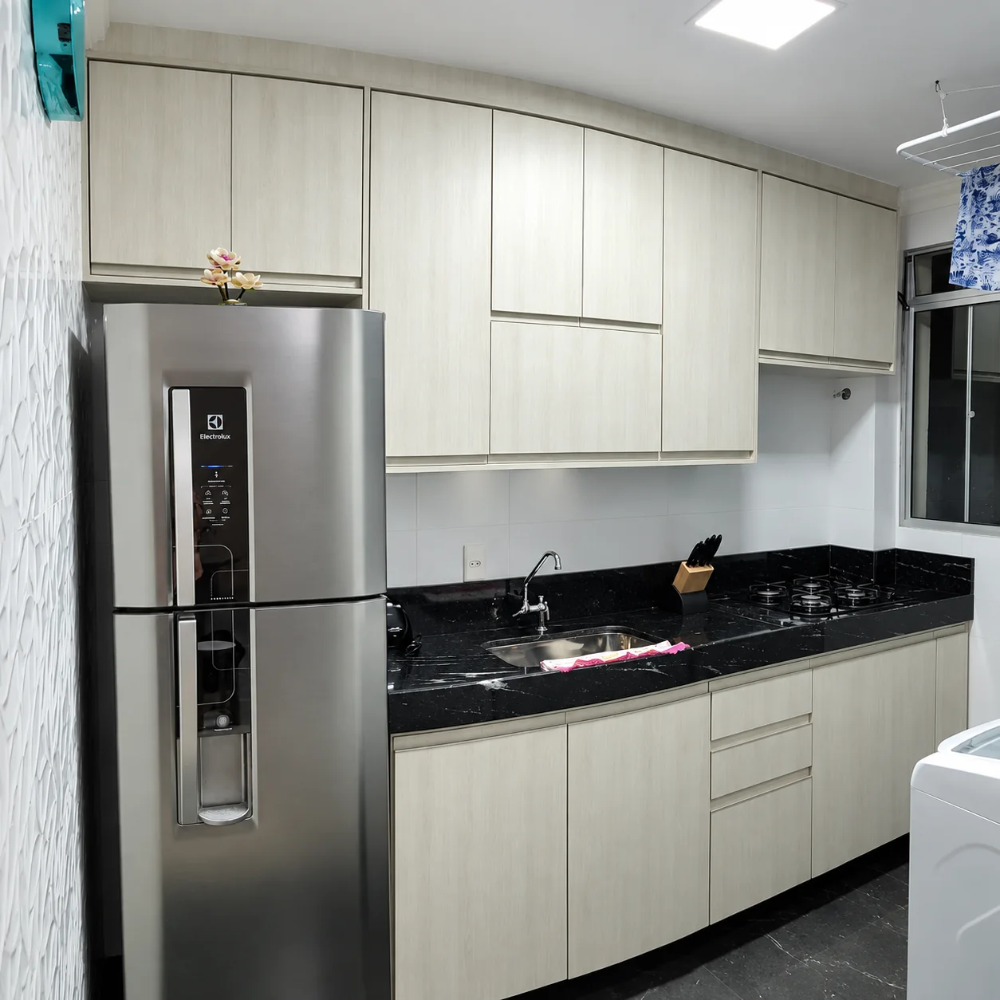

# Geovana Móveis — Site institucional

Site limpo, moderno e animado para marcenaria de móveis planejados. Totalmente
autocontido: **não precisa de build, nem de servidor** — basta abrir o `index.html`.

## Estrutura

```
marcenaria/
├── index.html          # Página única com todas as seções
├── css/styles.css      # Estilos, texturas de madeira e animações
├── js/main.js          # Interações (menu, slider, lightbox, formulário…)
├── assets/             # 12 fotos de ambientes (CC0 / CC BY, baixadas do Openverse)
└── README.md           # Este arquivo
```

## Como visualizar

Duplo clique no `index.html` ou suba a pasta para qualquer hospedagem
(Netlify, Vercel, HostGator etc.). As fontes vêm do Google Fonts; se ficar
offline, o site usa fontes do sistema automaticamente.

## Personalizações principais

### 1. Telefone / WhatsApp
No `index.html`, troque o link do botão flutuante:

```html
<a href="https://wa.me/5511999999999?text=..." class="whatsapp">
```

E no `js/main.js`:

```js
var WHATSAPP_NUMERO = "5511999999999";
```

Formato: DDI + DDD + número, sem espaços ou símbolos (ex.: Curitiba `5541`...).

O formulário de contato monta uma mensagem e abre o WhatsApp com ela.

### 2. Textos e informações
Edite direto no `index.html`: nome da marca, telefone, e-mail, endereço,
horário, depoimentos e descrições. As informações de contato aparecem em 3
lugares (header/nav não, seção contato e rodapé) — use **Localizar/Substituir**.

### 3. Fotos dos projetos
O site já vem com **12 fotos de ambientes** (cozinhas, dormitórios, salas, escritórios
e oficina de marcenaria) baixadas do Openverse com licença livre (CC0 / CC BY 2.0).
Elas estão na pasta `assets/` e são usadas no hero, na seção Sobre e na galeria.

Como são fotos de banco de imagens (não dos seus projetos reais), o ideal é
troca-las pelas fotos dos seus trabalhos do Instagram:

1. Coloque suas fotos em `assets/` (ex.: `assets/cozinha-1.jpg`).
2. No `index.html`, cada item da galeria tem uma linha como:

```html

```

3. Troque o `src` pelo nome do seu arquivo. Pronto — fallback, lightbox e
filtros continuam funcionando, pois a textura de madeira fica por baixo.

Se quiser reduzir o peso, imagens ~1600px de largura bastam.

### 4. Cores
No topo do `css/styles.css`:

```css
--amber:  #ff8a1e;   /* laranja-âmbar vivo (cor principal) */
--accent: #11b5a4;   /* azul-petróleo (contraste) */
--dark:   #1a1109;   /* escuro quente das seções e botões */
--bg:     #faf7f1;   /* fundo claro */
```

O coral `#ff4d6d` aparece em degradês (botões, barra de progresso, CTA).
Tudo está em variáveis no topo do arquivo — altere uma vez e se propaga.

### 5. Estatísticas do hero
No `index.html`:

```html
<span class="stat" data-count="15">0</span><span class="stat__plus">+</span>
<small>Anos de ofício</small>
```

### 6. Redes sociais
O ícone do Instagram já aponta para
`instagram.com/geovannamoveisplanejados`. O do Facebook ainda está como
`href="#"` — troque caso exista perfil.

## Recursos e animações inclusos

- Pré-carregador animado com logo
- Barra de progresso de rolagem
- Cursor personalizado (desktop)
- Menu mobile em gaveta + overlay
- Texto do hero com animação linha a linha
- Contadores animados ao entrar na tela
- Reveal em cascata ao rolar (scroll)
- Blobs com parallax no fundo do hero
- Faixa infinita (marquee) de diferenciais
- Galeria com **filtros por categoria** + **lightbox**
- Slider de depoimentos (auto-play, dots, setas e swipe)
- Botões magnéticos
- Formulário com validação que envia para o WhatsApp
- Botão flutuante do WhatsApp com pulso
- 100% responsivo + suporte a `prefers-reduced-motion`

## SEO básico

Já inclui `title`, `description` e tags Open Graph. Para indexar melhor:
adicione uma imagem real em `assets/og-image.jpg` e registre o site no
[Google Search Console](https://search.google.com/search-console).

---

Feito para **Geovana Móveis**. Bom proveito!
